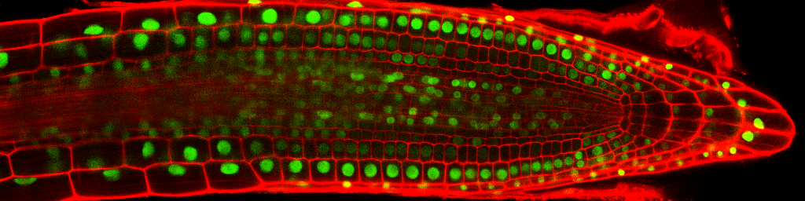
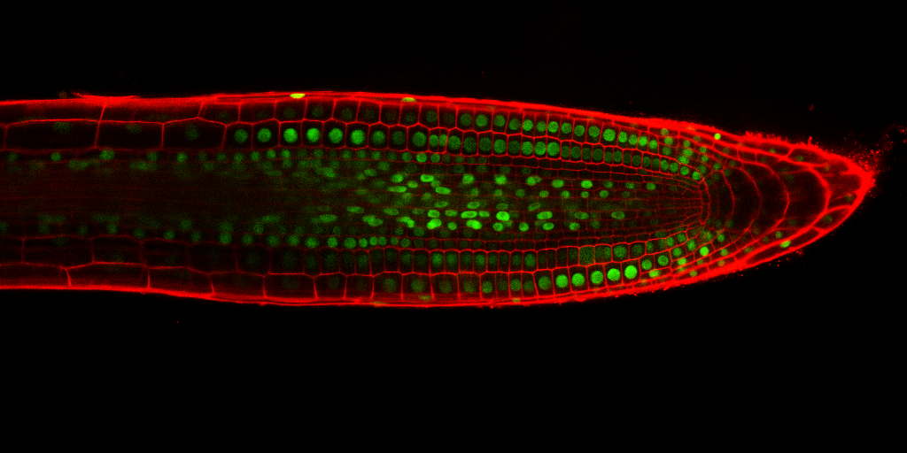
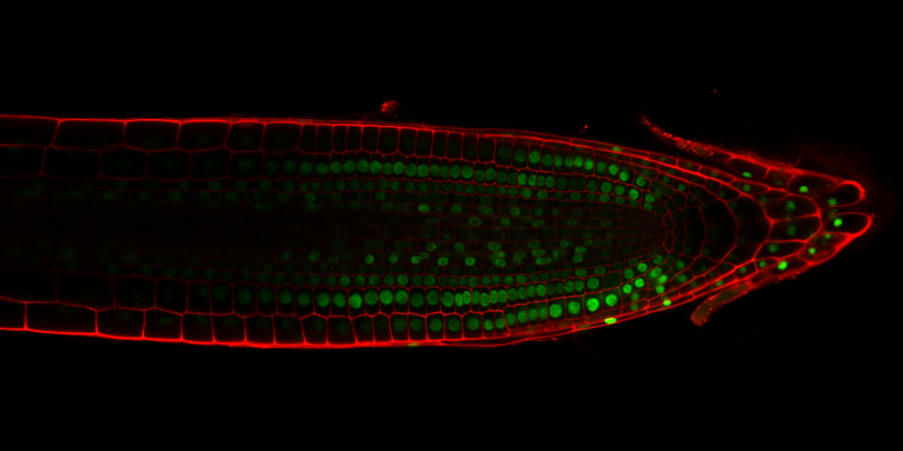
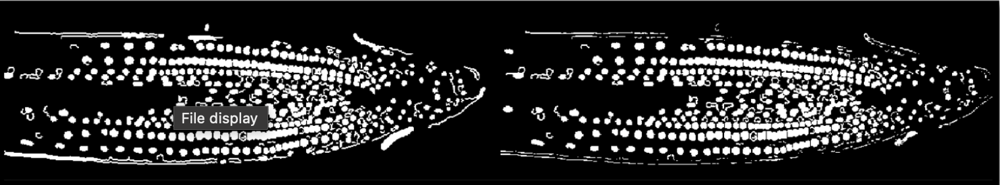
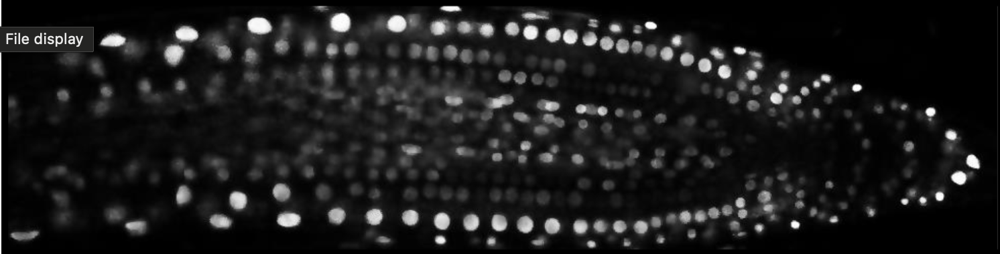
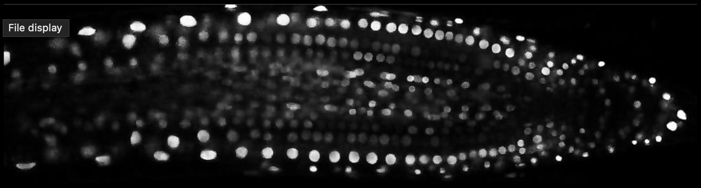
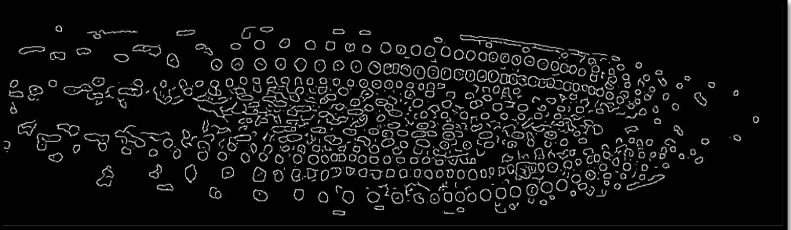
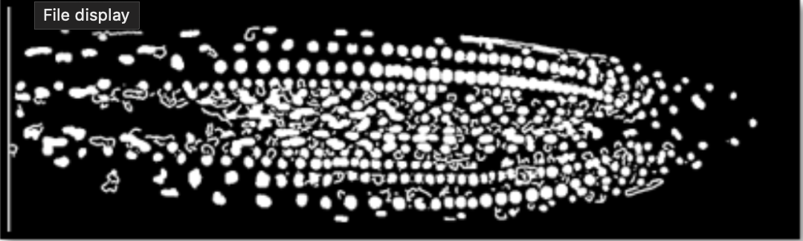

# Detecting Cell Nuclei in Confocal Microscope Images -  Coursework

> **Note**  
> The code has been shortened and the report has been removed to prevent plagiarism.  
> Only key methods and their results are shown here.

| Nuclei 1 | Nuclei 2 | Nuclei 3 |
|----------------|---------|-----------|
|  |  |  |

 

## Results 

## Overview

This project is part of the coursework at the University  . The objective is to develop a MATLAB program to process confocal laser microscope images of plant roots to identify and segment cell nuclei. The program converts each input image into a binary image where regions corresponding to cell nuclei are marked in white, and all other regions are marked in black. The project involves applying various image processing techniques, including color space conversion, noise reduction, thresholding, segmentation, and binary image processing.

# Intermediate Steps

| Anisotropic Diffusion | Sharpening  | 
|----------------|---------|
|  |  | 

| Edge Detection  | Dilation  | 
|----------------|---------|
|  || 

## Project Structure

- **src/**: Contains the MATLAB scripts and functions for processing the images.
  - `detect_nuclei.m`: Main script that processes the images.
  - `preprocess_image.m`: Function for color space conversion and noise reduction.
  - `segment_nuclei.m`: Function for thresholding and segmentation.
  - `postprocess_image.m`: Function for binary image cleanup.

- **images/**: Includes the confocal microscope images provided for the coursework.

- **report/**: Contains the written report, detailing methodology, results, and critical evaluation.
  - `report.pdf`: The final report describing the image processing methods, results, and evaluation.

- **README.md**: This file provides an overview of the project and instructions on running the MATLAB program.

## Prerequisites

- MATLAB with the Image Processing Toolbox installed.

## How to Run

1. **Prepare the Images**:
   - Ensure that the confocal microscope images are placed in the `images/` directory.

2. **Run the MATLAB Program**:
   - Open MATLAB and Execute the main script by
   - The script will process each image in the directory and generate binary images where cell nuclei are marked.

3. **View Results**:
   - The processed binary images will be displayed in MATLAB's figure windows.

## Report

The accompanying report includes:
- **Methodology**: Detailed explanation of the image processing techniques and reasons for their selection.
- **Results**: Presentation and analysis of the results obtained from processing the images.
- **Critical Evaluation**: Discussion of the strengths and weaknesses of the method, with references to specific results.

## Acknowledgments

This project was developed as part of the coursework at the University  . Special thanks to the course instructors for their guidance and support.

